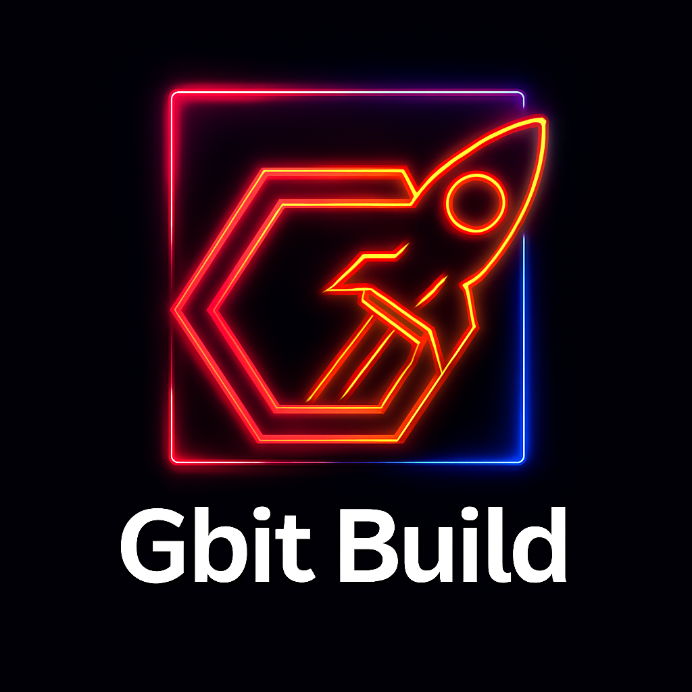

<p align="center">
  
</p>


<p align="center">
  <strong>Este projeto foi gerado com o <a href="https://www.npmjs.com/package/create-gbit-app">Gbit Framework</a> e empacotado com <a href="https://www.npmjs.com/package/gbit-build">Gbit Build</a>.</strong>
</p>

<p align="center">
  <a href="https://www.npmjs.com/package/gbit-build">
    
  </a>
  <a href="https://github.com/Gislaine-programadora/gbit-build">
    
  </a>
</p>

---

# 🛠️ Gbit Build

Empacotador oficial para projetos gerados com o Gbit Framework.  
Instala dependências, compila o frontend, prepara o backend e gera imagem Docker automaticamente.

---

## 🚀 Como usar

Instale como dependência de desenvolvimento:

```bash
npm install --save-dev gbit-build


Ou uso direto com NPX

npx gbit-build


##       🧱 O que o Gbit Build faz 
Esse comando instala dependências, compila o frontend, prepara o backend e gera a imagem Docker automaticamente. Ideal para projetos criados com o create-gbit-app.

## Gbit Build

Empacotador oficial para projetos gerados com o Gbit Framework.

### 🚀 Como usar

```bash
npx gbit-build


# Gbit Build

Empacotador oficial para projetos gerados com o Gbit Framework.

## Como usar

```bash
npx gbit-build

Esse comando instala dependências, compila frontend, prepara backend e gera imagem Docker automaticamente.

---

#  🧱 gbit-build: ferramenta de build completa
O pacote  é responsável por empacotar e preparar seu projeto com comandos simples e poderosos:
📦 Instalação

...

npm install --save-dev gbit-build
...

⚙️ Comandos disponíveis

`npx gbit-build               # Build completo
npx gbit-build --only-frontend
npx gbit-build --skip-docker
npx gbit-build --verbose
npx gbit-build --dry-run´


📄 Licença
Distribuído sob a licença MIT. Veja o arquivo LICENSE para mais informações.

👤 Autoria
- Gbit Team — @Gislaine-programadora

🌟 Suporte
Se este projeto te ajudou, deixe uma ⭐ no GitHub!
- Website: gbitframework.com
- Email: gislainelophes@gmail.com

Feito com ❤️ pela comunidade Gbit Framework

---

